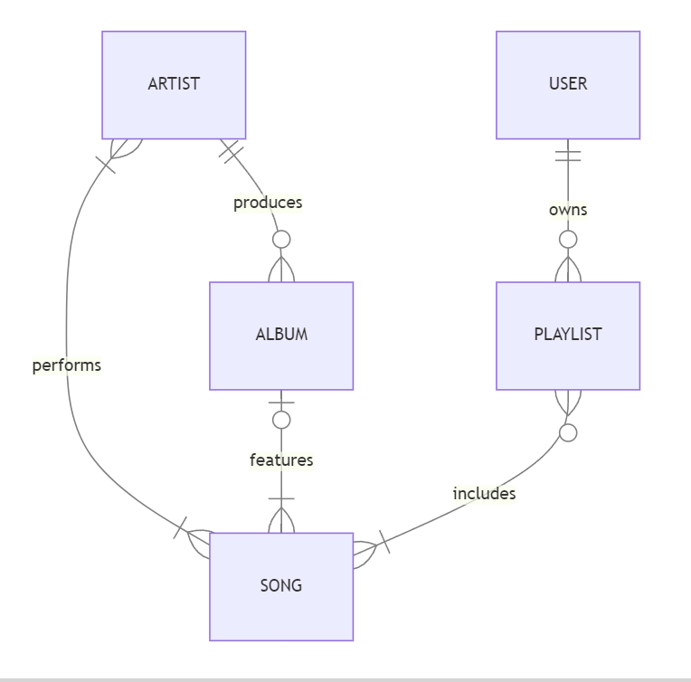

# Design Document

By Nedko Dimitrov

Video overview: <https://youtu.be/yIZQj3I6Zrg>

## Scope

The database for CS50 SQL includes all entities necessary to facilitate the process of capturing essential data related to songs and artists and creating user playlists. As such, included in the database's scope is:

* Artists, including basic identifying information
* Albums, including the title of the album, the artist who produced it and its release date.
* Songs, including basic information about the song and the album in which it is featured
* Users, including credentials and basic identifying information
* Playlists, including the title of the playlist and the user who created it

Out of scope are elements like the actual song audio files, album covers, music videos, and others.

## Functional Requirements

This database will support:

* CRUD operations for songs, aritsts, albums, users and playlists
* Associating a song with multiple aritsts.
* Creating multiple playlists per user.

Note that in this iteration, the system will not support actually playing the songs, displaying album covers, adding collaborative albums and associating a song with multiple genres.

## Representation

### Entities

The database includes the following entities:

#### Artists

The `artists` table includes:

* `id`, which specifies the unique ID for the artist as an `INTEGER`. This column thus has the `PRIMARY KEY` constraint applied.
* `first_name`, which specifies the artist's first name as `TEXT`, given `TEXT` is appropriate for name fields.
* `last_name`, which specifies the artist's last name. `TEXT` is used for the same reason as `first_name`.
* `country`, which specifies the country where the artist is from. `TEXT` is used for the same reason as `first_name`.
* `birth_date`, which specifies when the artist was born. Dates in SQLite can be conveniently stored as `NUMERIC`, per SQLite documentation at <https://www.sqlite.org/datatype3.html>.

The column `first_name` in the `artists` table is required and hence should have the `NOT NULL` constraint applied. The `birth_date` column has a constraint to check that it's not in the future.

#### albums

The `albums` table includes:

* `id`, which specifies the unique ID for the album as an `INTEGER`. This column thus has the `PRIMARY KEY` constraint applied.
* `title`, which specifies the title of the album as `TEXT`, given `TEXT` is appropriate for title fields.
* `artist_id`, which specifies the ID of the artist who produced the album as an `INTEGER`. This column thus has the `FOREIGN KEY` constraint applied, referencing the `id` column in the `artists` table, which ensures that each album be referenced back to an artist.
* `release_date`, which specifies when date on which the album was released. Dates in SQLite can be conveniently stored as `NUMERIC`, per SQLite documentation at <https://www.sqlite.org/datatype3.html>.

The column `title` in the `albums` table is required and hence should have the `NOT NULL` constraint applied. The `release_date` column has a constraint to check that it's not in the future.

#### songs

The `songs` table includes:

* `id`, which specifies the unique ID for the song as an `INTEGER`. This column thus has the `PRIMARY KEY` constraint applied.
* `title`, which specifies the title of the album as `TEXT`, given `TEXT` is appropriate for title fields.
* `release_date`, which specifies when date on which the album was released. Dates in SQLite can be conveniently stored as `NUMERIC`, per SQLite documentation at <https://www.sqlite.org/datatype3.html>.
* `duratiom`, which is a whole number taht specifies the duration of the song in number of seconds. So `INTEGER` would be appropriate.
* `album_id`, which specifies the ID of the album that features the song as an `INTEGER`. This column thus has the `FOREIGN KEY` constraint applied, referencing the `id` column in the `album` table, which ensures that each song be referenced back to an album.
* `track_number`, which specifies the number of the track in the album of which the song is a part and is `INTEGER` for the same reason as `duration`.

The column `title` in the `songs` table is required and hence should have the `NOT NULL` constraint applied. The `release_date` column has a constraint to check that it's not in the future. The `duratiom` and `track_nubmer` columns have constraints to check if thier values are greater than 0.

#### Users

The `users` table includes:

* `id`, which specifies the unique ID for the user as an `INTEGER`. This column thus has the `PRIMARY KEY` constraint applied.
* `first_name`, which specifies the user's first name as `TEXT`, given `TEXT` is appropriate for name fields.
* `last_name`, which specifies the user's last name. `TEXT` is used for the same reason as `first_name`.
* `username`, which specifies the user's username. `TEXT` is used for the same reason as `first_name`. A `UNIQUE` constraint ensures no two users have the same username.
* `password`, which specifies the user's password. `TEXT` is used for the same reason as `first_name`.

The columns `username` and `password` in the `artists` table are required and hence should have the `NOT NULL` constraint applied.

#### Playlists

The `playlists` table includes:
* `id`, which specifies the unique ID for the playlist as an `INTEGER`. This column thus has the `PRIMARY KEY` constraint applied.
* `title`, which specifies the title of the playlist as `TEXT`, given `TEXT` is appropriate for title fields.
* `user_id`, which specifies the ID of the user who created the playlist as an `INTEGER`. This column thus has the `FOREIGN KEY` constraint applied, referencing the `id` column in the `users` table, which ensures that each playlist be referenced back to a user.
* `created_at`, which specifies when the user created the playlist. Timestamps in SQLite can be conveniently stored as `NUMERIC`, per SQLite documentation at <https://www.sqlite.org/datatype3.html>. The default value for the `created_at` attribute is the current timestamp, as denoted by `DEFAULT CURRENT_TIMESTAMP`.

The column `title` in the `playlists` table is required and hence should have the `NOT NULL` constraint applied.

#### Performs

The `performs` table is a junction tale for the many-to-many relationship between the tables `artists` and `songs`. It includes:

* `artist_id`, which specifies the ID of the artist who performs the song as an `INTEGER`. This column thus has the `FOREIGN KEY` constraint applied, referencing the `id` column in the `artists` table, which ensures that each performance be referenced back to an artist.
* `song_id`, which specifies the ID of the song which is performed by the artist as an `INTEGER`. This column thus has the `FOREIGN KEY` constraint applied, referencing the `id` column in the `songs` table, which ensures that each performance be referenced back to a song.

Since `performs` is a junction table and one song cannot be associated with the same artist more than once, the `PRIMARY KEY` is comprised of the two `FOREIGN KEY` columns - `artists_id` and `song_id`.

#### Includes

The `includes` table is a junction tale for the many-to-many relationship between the tables `playlists` and `songs`. It includes:
* `playlist_id`, which specifies the ID of the playlist which includes the song as an `INTEGER`. This column thus has the `FOREIGN KEY` constraint applied, referencing the `id` column in the `playlists` table, which ensures that each including of a song be referenced back to a playlist.
* `song_id`, which specifies the ID of the song which is included in a playlist as an `INTEGER`. This column thus has the `FOREIGN KEY` constraint applied, referencing the `id` column in the `songs` table, which ensures that each including of a song be referenced back to a song.

Since `includes` is a junction table and one song cannot be included in a playlist more than once, the `PRIMARY KEY` is comprised of the two `FOREIGN KEY` columns - `playlist_id` and `song_id`.

### Relationships

The below entity relationship diagram describes the relationships among the entities in the database.

As detailed by the diagram:

* One artist can have 1 to many songs. They need at least 1 song to be considered an artist, and many if they have more than one song. A song is performed by 1 artist or by multiple artists in collaboration.
* One artist is capable of producing 0 to many albums. 0, if they have yet to produce an album, and many if they produce multiple albums. An album is made by one and only one artist. It is assumed that artists will produce individual albums (not collaborative albums).
* One album is capable of featuring 1 to many songs. There needs to be at least 1 song in an album. Albums generally featuring multiple songs. A song is featured in none albums or only one.
* One user is capable of creating 0 or many playlists. 0, if they have yet to create a playlist, and many if they create more than one playlist. A playlist is associated with one and only one user.
* One playlist is capable of including 1 to many songs. There needs to be at least 1 song in a playlist. Playlists generally include many songs. A song could be included in 0 or many playlists.

## Optimizations

Per the typical queries in `queries.sql`, it is common practice for users of the database to:

- Access all songs performed by any particular artist. For that reason, a composite index is created on the `first_name` and `last_name` columns in the `artists` table to speed the identification of artists by those columns. Also the `songs_by_artists` view is created that joins the tables `artists`, `perfors` and `songs` to make the qurries simpler.

- Access all songs included in any particular playlist. For that reason, a unique composite covering index is created on the `user_id` and `title` columns in the `playlists` table to speed the identification of playlists by those columns and not allow a user two have two playlists with the same name.

- Search for a song by title or album. For that reason, indexes are created on the `title` and `album_id` columns in the `songs` table to speed the identification of songs by those columns.

- Search for an album by title or artist. For that reason, indexes are created on the `title` and `artist_id` columns in the `albums` table to speed the identification of albums by those columns.

- List all songs from the past year. For that reason the `past_year_songs` view is created that selects songs and artists from the `songs_by_artists` view by fltering out songs whose release date was more than a year ago.

The composite primary keys in tables `performs` and `includes` automatically create covering indexes for the columns `artist_id` and `song_id`; and `playlist_id` and `song_id` respectfully.

## Limitations

The current schema doesn't support playing the songs or displaying album covers. That would require additional columns having the `BLOB` data type affinity.

it is assumed that an album is produced by only one artist. Collaborative albums would require a shift to a many-to-many relationship between artists and albums.

Also a song can be of only one genre. In order to support multiple genres, that would require an additional table for genres and a many-to-many relationship with the `songs` table.
